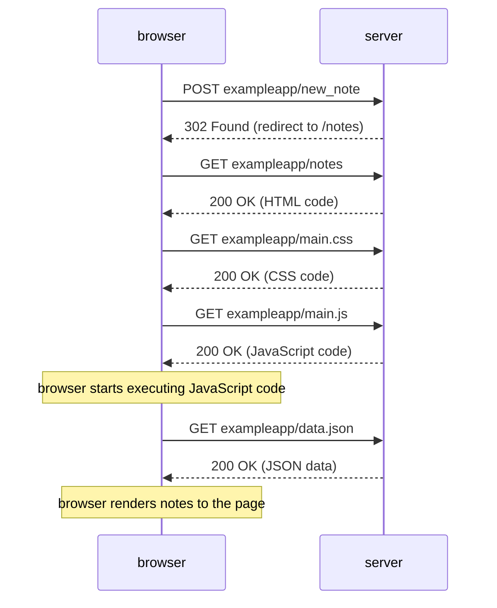

```mermaid
    sequenceDiagram
        browser ->>server: POST exampleapp/new_note
        server -->>browser: 302 Found (redirect to /notes)

        browser ->>server: GET exampleapp/notes
        server -->>browser: 200 OK (HTML code)

        browser ->>server: GET exampleapp/main.css
        server -->>browser: 200 OK (CSS code)

        browser ->>server: GET exampleapp/main.js
        server -->>browser: 200 OK (JavaScript code)

        note over browser: browser starts executing JavaScript code

        browser ->>server: GET exampleapp/data.json
        server -->>browser: 200 OK (JSON data)

        note over browser: browser renders notes to the page
```