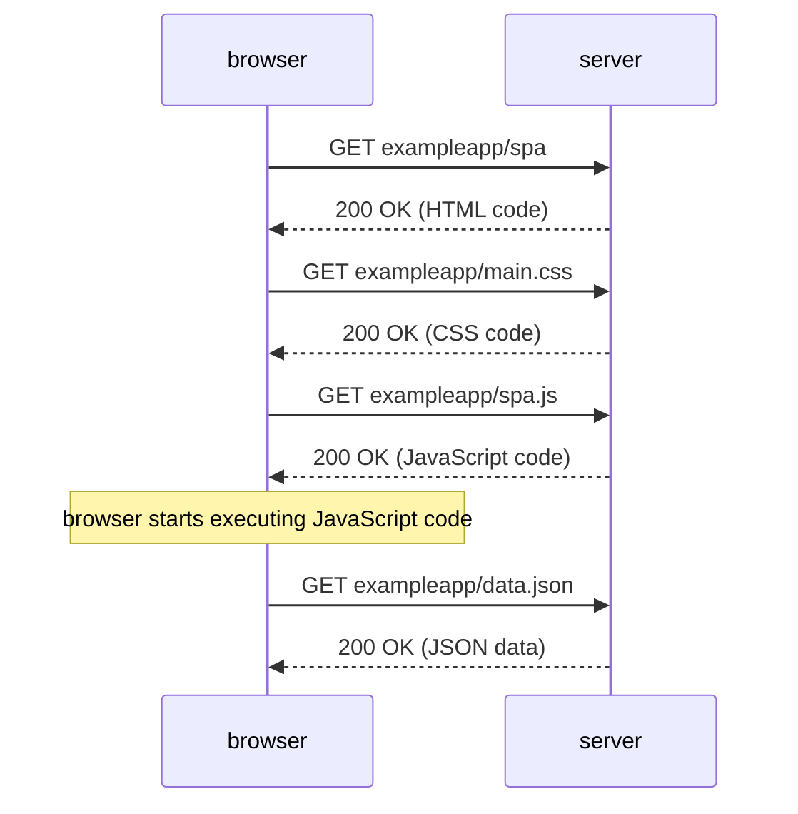

```mermaid
    sequenceDiagram
        browser ->>server: GET exampleapp/spa
        server -->>browser: 200 OK (HTML code)

        browser ->>server: GET exampleapp/main.css
        server -->>browser: 200 OK (CSS code)

        browser ->>server: GET exampleapp/spa.js
        server -->>browser: 200 OK (JavaScript code)

        note over browser: browser starts executing JavaScript code

        browser ->>server: GET exampleapp/data.json
        server -->>browser: 200 OK (JSON data)


```